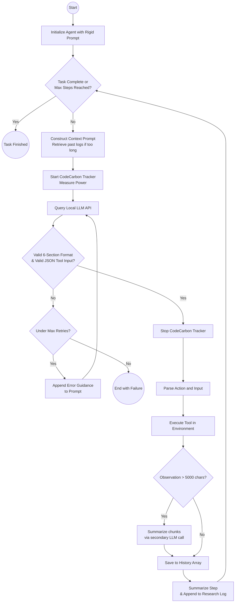

# The Research Agent Pipeline Explained

Located natively at `MLAgentBench/agents/agent_research.py`, the **Research Agent** (`ResearchAgent`) is the primary AI actor configured to autonomously solve machine learning assignments. Adapted for this master's thesis, it emphasizes highly structured API interactions, green-energy tracking, and context window management for local LLMs.

Here is a full breakdown of the agent and its step-by-step pipeline.

## 1. The Rigid Prompting Design
Standard open-source models (like 7B/8B parameter models) often struggle with formatting consistency and keeping track of long-term goals compared to massive cloud models (like GPT-4). To fix this, the agent is initialized with a **Rigid Prompting Structure**. 

Every output from the LLM *must* strictly contain the following six sections, mimicking a structured thought process:
1. **Reflection**: Analyzing the previous observation (e.g., *Did the script crash? Why?*).
2. **Research Plan and Status**: A continually updated high-level plan tracking what’s completed and what’s next.
3. **Fact Check**: Verifying that the plan isn't hallucinating successful results without direct proof from execution outputs.
4. **Thought**: The current short-term intent.
5. **Action**: The exact name of the tool to be used.
6. **Action Input**: A strictly valid JSON object containing parameters for the tool.

If the LLM fails to provide this format, an internal retry mechanism catches the error and appends an `INVALID_RESPONSE_INSTRUCTIONS` prompt, harshly correcting the LLM to abide by the required sections before trying again.

## 2. Step-by-Step Execution Pipeline
The agent operates within a massive `while` loop that continues until the environment signals `env.is_final()` (usually triggered by a "Final Answer" action). Each iteration of the loop represents one `step`:

### Step A: Prompt Construction & Memory Management
The agent builds the prompt for the current step. It doesn't load the *entire* history because local LLMs have limited context windows. Instead:
* It looks at a defined number of `last_steps` (usually the 3 most recent actions and observations).
* If the history is longer, it triggers a **Retrieval from Research Log** mechanism, providing a condensed summary of chronological progress without polluting the context window with raw code and logs.

### Step B: CodeCarbon Tracking (Green AI)
Before calling the LLM, the pipeline initializes `CodeCarbon`'s `EmissionsTracker`. 
* It starts measuring the GPU, CPU, and RAM power consumption specifically for the duration of this single LLM inference step.
* Results are periodically written to `step_XXXX_LLM.csv` inside a dedicated `codecarbon/` directory.

### Step C: Inference & Retry Loop
The agent attempts to query the local vLLM API (`complete_text`).
* It parses the text.
* If the JSON parsing for `Action Input` fails, or if it hallucinates a tool that doesn't exist, it rejects the response, adds error guidance to the prompt, and retries (up to `max_retries`).

### Step D: Execution
Once a valid tool name and JSON payload are extracted, the agent passes them to the environment (`env.execute()`). 
* Tools can be **Low-level** (Read File, Write File, Execute Script) or **High-level** (Understand File, Edit Script via AI).

### Step E: Observation Collection & Summarization
The tool outputs an `observation` (e.g., the console log of a python script finding an accuracy metric). 
* **Sliding Window Summarization**: If a script spits out a massive log (over 5000 characters), it will break the LLM's context limit. The Pipeline catches this and triggers `summarize_observation()`. This secondary AI prompt takes chunks of the log (10,000 characters at a time) and summarizes them objectively.
* The summarized observation is added to `history_steps`.

### Step F: Persistent Logging
Finally, the agent translates the step—its thoughts, actions, and observation—into a compact paragraph using `summarize_action_and_observation()` and appends it to the "Research Log" so the agent can remember what it did 20 steps later. The step state is saved to a JSON file.

## Flowchart Representation

## Summary
The pipeline treats a standard LLM like a strict state machine:
`Build Context` -> `Measure Energy` -> `Strict LLM Call` -> `Validate Format` -> `Execute Tool` -> `Summarize Large Outputs` -> `Save State` -> `Repeat`.
