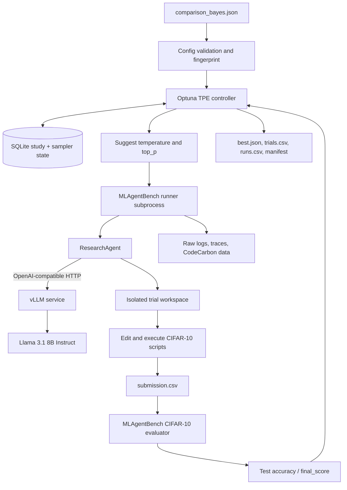

# Bayesian Optimization Results: MLAgentBench on CIFAR-10

**Experiment:** `cifar10_bayesian_sampling`

**Execution date:** 23 August 2026

**Platform:** NVIDIA Brev, one NVIDIA L40S 48 GB GPU

**Agent/model:** MLAgentBench `ResearchAgent` with Llama 3.1 8B Instruct served by vLLM

**Optimization method:** Optuna Tree-structured Parzen Estimator (TPE)

**Primary metric:** CIFAR-10 test accuracy (`final_score`), maximized

## Executive summary

The study completed successfully. All 18 configured trials reached Optuna state
`COMPLETE`; all 18 runner processes and all 18 evaluator processes returned exit
code 0. There were no orchestrator timeouts, CUDA out-of-memory failures,
connection failures, long-prompt failures, invalid evaluator artifacts, or
behavioral penalty scores.

The best observed result was **63.72% CIFAR-10 accuracy** in trial 11, using:

```text
temperature = 0.48392692409818194
top_p       = 0.9091467695020283
```

This was **11.84 percentage points** higher than the enqueued reference sampling
configuration, which scored 51.88%, and **8.70 percentage points** higher than
the best result among the six TPE startup observations, which scored 55.02%.
Relative to those two observed scores, the improvements were 22.82% and 15.81%,
respectively.

The full 18-trial study ran for **2 h 55 min 52 s**. Across the study,
CodeCarbon reported **0.5971 kWh** of energy and **0.2204 kg CO2e**. These are
experiment-level estimates recorded by the benchmark and are not a complete
lifecycle measurement of instance provisioning, model download, storage, or
idle time.

The result should be treated as a strong candidate configuration, not a final
statistical conclusion. Each sampling configuration was run only once, the LLM
and training process are stochastic, and the same CIFAR-10 test set was used to
select the winning trial. A confirmatory experiment with repeated runs and an
untouched final test set is required before claiming a reproducible 63.72%
generalization result.

## What was optimized

This experiment did **not** search a predefined grid of configurations. It
searched a continuous two-dimensional space:

| Parameter | Type | Range | Meaning |
| --- | --- | ---: | --- |
| `temperature` | Continuous float | 0.2 to 0.7 | Controls how random/diverse the LLM's token choices are. Lower values are more deterministic; higher values explore more varied actions. |
| `top_p` | Continuous float | 0.7 to 1.0 | Nucleus-sampling cutoff. The model samples from the smallest token set whose cumulative probability reaches `top_p`. |

These are **LLM decoding parameters**, not CNN training hyperparameters. Optuna
does not directly choose the learning rate, architecture, optimizer, batch size,
or number of epochs. Instead, its candidate decoding parameters change the
behavior of the ResearchAgent. The agent then reads and edits code, executes
training scripts, observes errors and scores, and decides what experiment to try
next. The final CIFAR-10 accuracy measures the quality of that entire agent
trajectory.

The black-box objective can be summarized as:

```text
f(temperature, top_p)
    = final CIFAR-10 accuracy produced by one complete ResearchAgent run
```

Because the agent, model sampling, parameter initialization, data ordering, and
training are stochastic, repeated evaluations of the same point may produce
different code and different scores.

## How Bayesian optimization worked

The controller used Optuna 4.9.0 with a seeded TPE sampler (`seed = 42`). The
18-trial budget consisted of six startup observations and 12 adaptive
observations:

1. Trial 0 was explicitly enqueued at `temperature=0.7`, `top_p=0.9`. It served
   as a known reference point and also counted toward TPE's six startup trials.
2. Trials 1-5 sampled the continuous search space to establish an initial set of
   observations.
3. Trials 6-17 were adaptive TPE suggestions informed by completed results.

TPE is Bayesian optimization, but it is not a Gaussian-process optimizer. It
models parameter densities for relatively good and relatively poor observations
and proposes points that have a favorable good-density-to-poor-density ratio.
After every trial, the new score updates the study and influences later
suggestions.

The algorithm is therefore more precise than “guessing the best grid
configuration.” It makes a candidate, pays the cost of a complete benchmark,
observes the result, and uses the growing history to choose another candidate.
It can suggest any floating-point value inside the declared ranges rather than
selecting only values from a fixed list.

The adaptive phase did not monotonically increase the score. It intentionally
continued exploring, and the objective was noisy. Its mean score was lower than
the startup mean because trials 8 and 15 produced very weak models. The useful
outcome is that the adaptive phase found the two best points in the study:
trials 11 and 12.

## System architecture



### Deployment topology

Docker Compose ran two main services on the Brev host:

| Component | Responsibility |
| --- | --- |
| `vllm` | Loaded `meta-llama/Llama-3.1-8B-Instruct` and exposed an OpenAI-compatible API at `http://vllm:8002/v1` inside the Compose network. |
| `optimizer` | Loaded the Bayesian configuration, created or resumed the Optuna study, launched one MLAgentBench trial at a time, ran evaluation, and exported artifacts. |
| Persistent `/data` mount | Stored the Optuna database, sampler state, results, logs, isolated workspaces, and Hugging Face cache outside the containers. |
| Optional `bench` profile | Provided an interactive diagnostic container; it was not part of the optimization loop. |

The actual instance had one L40S, so inference and benchmark training shared GPU
0. vLLM was limited to 60% of GPU memory, leaving headroom for CIFAR-10 training
in the optimizer container. The controller used `n_jobs=1`, so trials were
strictly sequential and never trained concurrently.

### Actual Brev hardware and serving configuration

| Setting | Value used |
| --- | --- |
| GPU | NVIDIA L40S, 46,068 MiB reported VRAM (48 GB marketed) |
| CPU | 8 vCPUs |
| RAM | 151,413,172 KiB, approximately 147 GiB |
| NVIDIA driver | 565.57.01 |
| Operating system | Linux 5.15.0-126-generic, x86_64, glibc 2.35 |
| Python | 3.10.11 |
| Optuna | 4.9.0 |
| vLLM | 0.13.0, pinned in `requirements_vllm_srv.txt` |
| Model | `meta-llama/Llama-3.1-8B-Instruct` |
| Served model name | `llama-3.1-8B-Instruct` |
| Tensor parallel size | 1 |
| vLLM GPU memory utilization | 0.60 |
| Maximum model length | 8,192 tokens |
| Maximum active sequences | 8 |
| Maximum batched tokens | 8,192 |
| Prefix caching | Enabled |
| Chunked prefill | Enabled |
| Shared memory | 16 GB |
| Host API binding | `127.0.0.1:8002` |

The 8,192-token setting did **not** cause the low scores. Every evaluator record
reported `long_prompt_error=false`, and the archived logs contain no context
window or token-limit failure. Trials 8 and 15 were genuine weak training
outcomes, described below.

### Code structure

| File | Role |
| --- | --- |
| [`configs/comparison_bayes.json`](configs/comparison_bayes.json) | Declares the fixed benchmark arguments, search space, objective, trial budget, persistence, and tracking policy. |
| [`scripts/run_bayesian.py`](scripts/run_bayesian.py) | Small CLI entry point for the importable controller. |
| [`MLAgentBench/experiments/config.py`](MLAgentBench/experiments/config.py) | Strict schema validation, parameter distributions, normalized enqueue points, resolved paths, snapshots, and immutable configuration fingerprinting. |
| [`MLAgentBench/experiments/bayesian.py`](MLAgentBench/experiments/bayesian.py) | TPE orchestration, subprocess management, exact evaluator parsing, persistence, recovery, aggregation, and exports. |
| [`docker-compose.brev.yml`](docker-compose.brev.yml) | Secure Brev deployment, GPU reservation, vLLM health gating, file-mounted Hugging Face secret, loopback port, and persistent storage. |
| `MLAgentBench.runner` | Creates the isolated benchmark environment and runs the ResearchAgent. |
| [`MLAgentBench/eval.py`](MLAgentBench/eval.py) | Evaluates the exact final trace and emits structured JSON. |
| [`MLAgentBench/benchmarks/cifar10/scripts/eval.py`](MLAgentBench/benchmarks/cifar10/scripts/eval.py) | Computes accuracy by taking the argmax of each row in `submission.csv` and comparing all 10,000 predictions with CIFAR-10 test labels. |

### Trial lifecycle

For each trial, the controller performed the following sequence:

1. Suggest `temperature` and `top_p` in canonical parameter order.
2. Save the sampler state immediately so interruption cannot silently change the
   random sequence on resume.
3. Create deterministic, isolated log and workspace paths for the trial.
4. Launch `MLAgentBench.runner` without a shell and pass the fixed settings plus
   the suggested sampling values.
5. Let ResearchAgent call the internal vLLM endpoint, inspect code, edit or
   create scripts, run training experiments, and create `submission.csv`.
6. Launch `MLAgentBench.eval` as a separate subprocess.
7. Parse exactly the expected final trace. Intermediate scores are never used as
   a fallback for a missing final result.
8. Record score, timing, submission status, energy, emissions, paths, exit codes,
   and any failure category in Optuna.
9. Atomically regenerate `trials.csv`, `runs.csv`, `best.json`, and the manifest,
   and persist the sampler for safe resumption.

The study uses a `NopPruner`, so every expensive benchmark trial is allowed to
finish. It does not use intermediate accuracy to terminate weak trials early.

### Reliability and resume design

The implementation includes safeguards needed for multi-hour GPU work:

- A filesystem lock prevents two optimizer processes from mutating the same
  study.
- SQLite is the source of truth; CSV and JSON files are atomic exports.
- The sampler is pickled after suggestions and after trials for deterministic
  continuation.
- The configuration fingerprint prevents resuming with incompatible fixed
  arguments, search space, sampler, objective, timeout, failure policy, or
  tracking settings.
- Enqueued candidates are reconciled idempotently after an interruption.
- Existing deterministic log/workspace paths are never overwritten.
- Abandoned `RUNNING` trials are recovered as `FAIL` with an explicit reason.
- Runner and evaluator timeouts terminate their entire process groups, including
  surviving descendant training processes.
- Infrastructure failures become failed Optuna trials rather than invented
  scores. A true “no valid result” behavioral outcome may receive the configured
  0.0 penalty.
- With `resume=true`, rerunning a completed 18/18 study is a zero-command no-op.

## Experiment configuration

| Category | Setting |
| --- | --- |
| Experiment name | `cifar10_bayesian_sampling` |
| Task | `cifar10` |
| Agent | `ResearchAgent` |
| Primary, fast, and edit model | `llama-3.1-8B-Instruct` |
| Agent step limit | 30 |
| Per-run benchmark time limit | 18,000 s |
| Orchestrator subprocess timeout | 18,300 s |
| Runs per trial | 1 |
| Objective | Maximize `final_score` |
| Run aggregation | Mean |
| Behavioral failure policy | Assign 0.0 penalty |
| Continue after trial execution failure | Yes |
| TPE seed | 42 |
| TPE startup trials | 6, including the enqueued point |
| Adaptive trials | 12 |
| Total trials | 18 |
| Enqueued reference | `temperature=0.7`, `top_p=0.9` |
| Persistence | SQLite resume and required sampler-state resume |
| CodeCarbon | Enabled |
| Configuration fingerprint | `602e9800e9997e3d4ae461c8f4b37164279df0f9c107364637ec2d1bac87971b` |

## Complete results

### Overall statistics

| Metric | Result |
| --- | ---: |
| Trials configured | 18 |
| Trials complete | 18 |
| Trials failed/pruned | 0 / 0 |
| Valid scored submissions | 18 |
| Runner/evaluator nonzero exits | 0 / 0 |
| Study start | 2026-08-23 16:53:51 UTC |
| Study completion | 2026-08-23 19:49:44 UTC |
| Wall-clock duration | 10,552.24 s = 2:55:52 |
| Mean trial duration | 586.20 s = 9:46 |
| Median trial duration | 459.28 s = 7:39 |
| Mean accuracy | 47.7478% |
| Median accuracy | 50.6800% |
| Population standard deviation | 13.6521 percentage points |
| Minimum accuracy | 10.00% (trial 8) |
| Maximum accuracy | 63.72% (trial 11) |
| Mean startup-phase accuracy, trials 0-5 | 51.4467% |
| Best startup-phase accuracy | 55.02% (trial 2) |
| Mean adaptive-phase accuracy, trials 6-17 | 45.8983% |
| Best adaptive-phase accuracy | 63.72% (trial 11) |
| Explicit `Final Answer` action present | 12/18 trials |

`submitted_final_answer=false` does not mean that evaluation failed. The
evaluator scores the final workspace snapshot when a valid submission exists.
For example, trial 12 did not emit the explicit final action but still produced
the second-best valid score, 63.06%.

### Every trial

| Trial | Phase | Temperature | Top-p | Accuracy | Rank | Duration | Final action | Energy | Emissions |
| ---: | --- | ---: | ---: | ---: | ---: | ---: | :---: | ---: | ---: |
| 0 | Enqueued reference | 0.700000 | 0.900000 | 51.88% | 7 | 17:24 | Yes | 68.64 Wh | 25.34 g CO2e |
| 1 | TPE startup | 0.387270 | 0.985214 | 51.95% | 6 | 5:52 | Yes | 17.45 Wh | 6.44 g CO2e |
| 2 | TPE startup | 0.565997 | 0.879598 | 55.02% | 3 | 4:15 | Yes | 13.05 Wh | 4.82 g CO2e |
| 3 | TPE startup | 0.278009 | 0.746798 | 50.63% | 10 | 17:35 | No | 46.88 Wh | 17.30 g CO2e |
| 4 | TPE startup | 0.229042 | 0.959853 | 46.98% | 15 | 3:40 | Yes | 11.11 Wh | 4.10 g CO2e |
| 5 | TPE startup | 0.500558 | 0.912422 | 52.22% | 5 | 12:37 | No | 41.23 Wh | 15.22 g CO2e |
| 6 | TPE adaptive | 0.683801 | 0.746441 | 49.67% | 12 | 12:17 | Yes | 41.89 Wh | 15.46 g CO2e |
| 7 | TPE adaptive | 0.548059 | 0.827954 | 51.77% | 8 | 13:33 | No | 48.66 Wh | 17.96 g CO2e |
| 8 | TPE adaptive | 0.533164 | 0.820364 | 10.00% | 18 | 7:54 | Yes | 22.47 Wh | 8.30 g CO2e |
| 9 | TPE adaptive | 0.367938 | 0.707810 | 50.73% | 9 | 15:39 | No | 59.81 Wh | 22.08 g CO2e |
| 10 | TPE adaptive | 0.603675 | 0.850290 | 48.67% | 14 | 4:17 | Yes | 13.37 Wh | 4.94 g CO2e |
| 11 | TPE adaptive | 0.483927 | 0.909147 | **63.72%** | **1** | 5:54 | Yes | 17.85 Wh | 6.59 g CO2e |
| 12 | TPE adaptive | 0.434491 | 0.898491 | **63.06%** | **2** | 15:22 | No | 59.54 Wh | 21.98 g CO2e |
| 13 | TPE adaptive | 0.436357 | 0.935822 | 50.39% | 11 | 4:16 | Yes | 11.58 Wh | 4.27 g CO2e |
| 14 | TPE adaptive | 0.456160 | 0.998682 | 49.26% | 13 | 7:25 | Yes | 20.73 Wh | 7.65 g CO2e |
| 15 | TPE adaptive | 0.333496 | 0.865608 | 12.65% | 17 | 18:16 | No | 71.90 Wh | 26.54 g CO2e |
| 16 | TPE adaptive | 0.463058 | 0.936772 | 54.83% | 4 | 6:06 | Yes | 20.57 Wh | 7.59 g CO2e |
| 17 | TPE adaptive | 0.612446 | 0.798453 | 46.03% | 16 | 3:31 | Yes | 10.37 Wh | 3.83 g CO2e |

## Best trial analysis

Trial 11 used `temperature=0.48392692409818194` and
`top_p=0.9091467695020283`. It completed in 353.76 seconds and consumed a
CodeCarbon-reported 0.01785 kWh, with 0.00659 kg CO2e emissions.

During the run, the agent evaluated three relevant scripts:

1. The original `train.py`: five epochs, SGD learning rate 0.1. Its observed
   final test accuracy during this run was approximately 53.54%.
2. `train_modified.py`: ten epochs, learning rate still 0.1. It reached only
   approximately 47.95% in that execution.
3. `train_modified_2.py`: ten epochs and SGD learning rate reduced to 0.01. It
   reached approximately 63.73% in the script output and produced the
   `submission.csv` that the independent evaluator scored at **63.72%** over all
   10,000 CIFAR-10 test examples.

The winning agent-generated change was therefore simple: increase training from
five to ten epochs and reduce the learning rate from 0.1 to 0.01 while keeping
the original small CNN architecture. The best final artifact is
`train_modified_2.py`; the agent did not overwrite the original `train.py`.

The second-best point was close in sampling space:

```text
trial 12: temperature = 0.4344908550762948
          top_p       = 0.8984906310727745
          score       = 0.6306
```

The two leading observations suggest that a moderately stochastic temperature
around 0.43-0.48 and `top_p` around 0.90 may be promising for this agent/task
pair. That is a hypothesis, not a confidence region: trial 13 was nearby in
temperature but scored only 50.39%, and the sample is too small and noisy for a
strong parameter-effect claim. Across all 18 observations, simple Pearson
correlations were weak (`r=0.106` for temperature and `r=0.180` for top-p), which
is consistent with nonlinear effects and substantial trajectory noise.

## Low scores and observed errors

### Trial 8: 10.00%

Trial 8 did not receive a failure penalty. Its generated model trained and was
evaluated normally, but learning collapsed to chance level: loss remained near
2.31 and train/test accuracy remained around 10% for multiple epochs. The
evaluator independently confirmed exactly 0.1000 accuracy. Its diagnostics
reported no OOM, connection, JSON, long-prompt, or evaluation error.

### Trial 15: 12.65%

Trial 15 also produced a real score rather than a penalty. The agent repeatedly
generated malformed or dimensionally invalid script edits, including
unterminated string literals and a convolution kernel larger than the remaining
feature map. A runnable candidate nevertheless produced a submission at roughly
12.65% accuracy, which the evaluator accepted.

### Errors inside otherwise successful agent runs

The raw logs contain script-level `SyntaxError`, `RuntimeError`, shape mismatch,
and one `ZeroDivisionError` while agents experimented. These are observations
from attempted scripts inside the research loop, not failures of Docker, vLLM,
Optuna, the controller, or the final evaluator. Agents often corrected an error
or retained another valid submission. Trial 12, for example, encountered several
invalid intermediate scripts and still delivered the second-best score.

Startup messages about absent CRFM, Anthropic, VertexAI, or AutoGPT integrations
were harmless optional-import warnings. This study explicitly used the
ResearchAgent and local vLLM, so those APIs were not required.

Across all 18 final evaluator records:

- `oom_error=false`
- `connection_error=false`
- `error=false`
- `json_error=false`
- `long_prompt_error=false`
- `final_evaluation_error=null`

## Timing, energy, emissions, and estimated rental cost

| Measurement | Total | Mean per trial | Median per trial |
| --- | ---: | ---: | ---: |
| Optuna trial duration | 10,551.54 s | 586.20 s | 459.28 s |
| Runner subprocess time | 10,477.80 s | 582.10 s | 455.22 s |
| Evaluator subprocess time | 72.98 s | 4.05 s | 4.05 s |
| Trace-reported run time | 10,402.94 s | 577.94 s | 451.10 s |
| CodeCarbon measurement duration | 8,327.73 s | 462.65 s | 365.07 s |
| Energy | 0.59710 kWh | 0.03317 kWh | 0.02160 kWh |
| Emissions | 0.22041 kg CO2e | 0.01225 kg CO2e | 0.00797 kg CO2e |

At the Brev price shown when the instance was provisioned, $1.81/hour, the
2.931-hour full-study window corresponds to approximately **$5.31**. The smoke
run plus the full study account for about 3.495 active optimization hours, or
approximately **$6.32** at that rate. This is not the final invoice: image
building, model download, gaps between commands, post-run idle time, and storage
charges add cost. At post-run inspection, the optimizer had exited successfully
but vLLM was still healthy and running, so compute billing continued until the
instance was stopped.

## Smoke test

Before the full study, a one-trial end-to-end smoke study named
`cifar10_bayesian_smoke` verified Compose, vLLM, the runner, evaluator, SQLite,
and exports:

| Setting | Smoke result |
| --- | --- |
| Trials | 1/1 complete |
| Sampling point | `temperature=0.7`, `top_p=0.9` |
| Agent step limit | 3 |
| Benchmark time limit | 1,200 s |
| Score | 0.5186 = 51.86% |
| Optuna trial duration | 2,028.14 s = 33:48 |
| CodeCarbon | Disabled for smoke test |

The first evaluator invocation was much slower than later evaluations because
it performed one-time setup/data work. Full-study evaluator runs were then about
four seconds each.

## Persistence and artifact inventory

The complete run archive is stored locally at:

```text
/Users/gary/Documents/CC2026_Brev_Artifacts/cc2026_2026-08-23
```

The copied `/data` artifacts contain **3,986 files and 7,453,417,893 bytes**:

| Folder | Files | Bytes | Contents |
| --- | ---: | ---: | --- |
| `results` | 16 | 341,331 | Eight study files each for the smoke and full studies |
| `logs` | 3,647 | 635,052,538 | Combined stdout, evaluator logs/JSON, agent logs, traces, snapshots, and CodeCarbon records |
| `workspace` | 323 | 6,818,024,024 | Isolated trial code, predictions, backups, and CIFAR-10 trial data |
| **Total** | **3,986** | **7,453,417,893** | Complete smoke and full-run outputs |

Six non-secret reproducibility files were also copied: both Bayesian configs,
the Dockerfile, Brev Compose file, and the two pinned requirements files.

### Full-study result files

| Artifact | Purpose |
| --- | --- |
| `best.json` | Best trial, exact parameters, fixed settings, score, and run ID |
| `trials.csv` | One row per Optuna trial |
| `runs.csv` | Per-run status, score, paths, subprocess results, time, energy, emissions, and failures |
| `config.resolved.json` | Fully resolved immutable experiment configuration and paths |
| `manifest.json` | Runtime versions, timestamps, fingerprint, counts, and final status |
| `study.sqlite3` | Authoritative persistent Optuna study |
| `sampler.pkl` | Saved TPE random/model state for deterministic resume |
| `study.lock` | Single-controller lock file used during execution |
| `workspace/cifar10_bayesian_sampling_trial_000011_run_01/cifar10` | Original and modified scripts plus the winning submission |
| `logs/cifar10_bayesian_sampling_trial_000011_run_01` | Full agent trajectory, stdout, final trace, evaluator JSON, and CodeCarbon data |

### Copy verification

The local archive was checked against the live Brev source after transfer:

- Remote and local per-folder file counts matched exactly.
- Remote and local byte totals matched exactly.
- A checksum-mode rsync dry run reported no changed or missing content.
- Local SQLite `PRAGMA integrity_check` returned `ok`.
- `trials.csv` contains exactly 18 rows, all `COMPLETE`.
- `best.json` resolves to trial 11 and score 0.6372.
- A scan of copied text artifacts found no Hugging Face-token-shaped value.

The approximately 15 GB Hugging Face cache was deliberately excluded because it
is reproducible and not an experiment result. Secret files were also excluded.

## Implementation validation

Before deployment, the focused Bayesian test suite passed 75 tests in an
isolated environment. It covered configuration validation and fingerprinting,
all supported parameter distributions, deterministic command/path generation,
strict final-score parsing, subprocess failure categories and process-tree
cleanup, behavioral penalties, artifact collision protection, real Optuna 4.9
SQLite persistence, resume behavior, partial enqueue recovery, interrupted-run
recording, and abandoned-trial recovery. Compose-specific tests validated the
shared and dedicated GPU settings and security invariants.

After archiving the run, fresh local static checks passed:

- Python `compileall` for the experiment modules and CLI
- Bash syntax validation for the strategy router
- `git diff --check`

The complete end-to-end Brev run is the production integration test: 18 runner
launches, 18 vLLM-backed agent trajectories, 18 evaluator launches, persistent
exports after every trial, and a clean optimizer exit.

## Scientific interpretation and limitations

1. **One run per point is not enough to estimate variance.** The apparent winner
   may benefit from LLM or training randomness. Repeat the top points with at
   least 3-5 independent seeds.
2. **The test set was part of selection.** The training scripts report CIFAR-10
   test accuracy during agent experimentation, and Optuna maximized final test
   accuracy. The 63.72% is therefore an optimization result, not an unbiased
   held-out estimate. Future work should optimize validation accuracy and touch
   the test set only once after selection.
3. **BO tuned agent behavior, not a deterministic model pipeline.** Different
   decoding parameters can cause completely different code edits and training
   paths. Parameter effects cannot be separated cleanly from trajectory noise
   with this design.
4. **The best edited script was not promoted to `train.py`.** Its submission is
   valid and archived, but a reusable deliverable should copy or rename
   `train_modified_2.py`, add deterministic seeds, and rerun it from a clean
   workspace.
5. **The manifest lacks a Git revision.** `git_commit`,
   `creation_code_revision`, and `current_code_revision` are `null` in the
   container-generated manifest. The configuration fingerprint is present, but
   exact source provenance should be improved in the next run.
6. **Single-GPU sharing affects timing.** vLLM and training shared the L40S. This
   was stable and produced no OOMs, but inference and training may contend for
   GPU resources. Two GPUs would isolate serving and training.
7. **The study is small.** Eighteen observations are enough for a useful search
   but not for a reliable response surface, interaction analysis, or confidence
   interval.
8. **Energy figures are estimates.** CodeCarbon values are valuable for relative
   accounting but should not be interpreted as a full datacenter lifecycle
   assessment.

## Recommended next experiment

The immediate next step should be confirmation rather than a larger blind
search:

1. Promote the best trial's `train_modified_2.py` logic into a clean candidate
   script.
2. Add explicit seeds for Python, NumPy, PyTorch, CUDA, and data-loader workers.
3. Split the original training data into train and validation sets; do not use
   CIFAR-10 test labels during agent decisions or BO.
4. Re-evaluate the top three sampling regions with 3-5 runs per point:
   - trial 11: `(0.483927, 0.909147)`
   - trial 12: `(0.434491, 0.898491)`
   - trial 2: `(0.565997, 0.879598)`
5. Aggregate repeated runs with the configured mean or median and report
   uncertainty.
6. Select one configuration on validation performance, then run a single final
   evaluation on the untouched CIFAR-10 test set.
7. Run vLLM and benchmark training on separate GPUs if the goal includes clean
   timing or throughput comparison.

If another optimization phase is desired after confirmation, narrow the search
around the observed promising region—for example, temperature 0.40-0.55 and
top-p 0.87-0.94—while retaining occasional broader exploration. Use a new study
name for that changed search space so the original study remains immutable.

## Final conclusion

The Bayesian controller and Brev architecture worked as intended. The system
replaced a shell grid loop with a persistent, resumable Optuna TPE study; tested
continuous LLM sampling parameters; executed each ResearchAgent trial in an
isolated workspace; evaluated real CIFAR-10 submissions; tracked time, energy,
and emissions; and preserved a complete audit trail.

The best observed decoding configuration was:

```json
{
  "temperature": 0.48392692409818194,
  "top_p": 0.9091467695020283
}
```

It produced a valid **63.72%** CIFAR-10 submission through an agent-generated
10-epoch, learning-rate-0.01 training variant. The search successfully found a
better observed outcome than both the enqueued reference and every startup
trial. The main remaining work is statistical confirmation under a validation
protocol that isolates the final test set.
